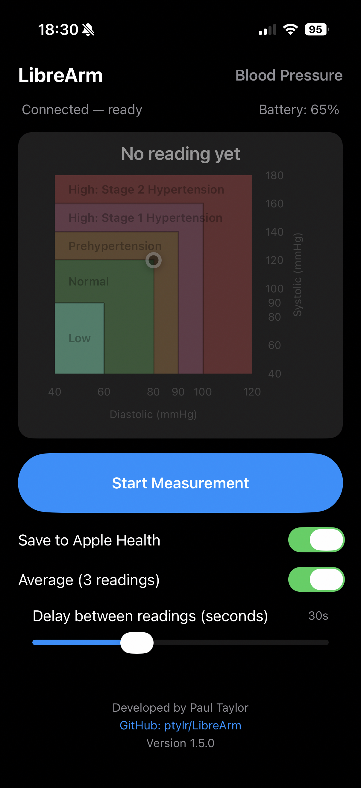
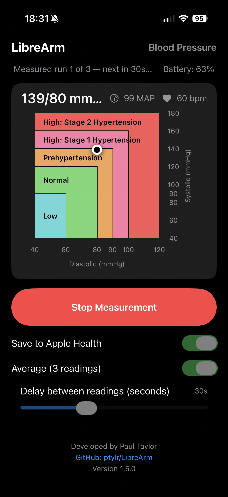

```
        __          .__
_______/  |_ ___.__.|  |_______
\____ \   __<   |  ||  |\_  __ \
|  |_> >  |  \___  ||  |_|  | \/
|   __/|__|  / ____||____/__|
|__|         \/

https://ptylr.com  
https://www.linkedin.com/in/ptylr/
```

# LibreArm

LibreArm is an open-source iOS app that connects directly to the **QardioArm** blood pressure monitor via Bluetooth Low Energy (BLE) and saves readings into **Apple Health**.  
This project exists because Qardio, Inc. shut down its backend services and app support, leaving the QardioArm hardware functional but unusable with the original app.

- 📲 **Available on the [Apple App Store](https://apps.apple.com/gb/app/librearm/id6752661389)**  
- 💻 Open source on [GitHub](https://github.com/ptylr/LibreArm) for transparency and community contributions  

---

## ✨ Features (v1.5.0)

### New in v1.5.0

- **Always-Visible Hypertension Graph**: Blood pressure graph now permanently displayed on main screen
  - No longer hidden behind a modal/button
  - Shows placeholder graph with reduced opacity when no reading exists yet
  - Graph updates automatically with each new reading
  - Color-coded zones: Low (cyan), Normal (green), Prehypertension (orange), Stage 1 (pink), Stage 2 (red)
- **Settings Persistence**: User preferences now saved between app sessions
  - "Save to Apple Health" toggle state persisted
  - "Average (3 readings)" mode selection persisted
  - Delay slider value persisted (15s, 30s, 45s, or 60s)
  - Settings restored automatically on app launch
- **Improved UI Layout**: Streamlined interface with no shifting elements
  - Removed app icon from main view (less clutter)
  - Top bar shows "LibreArm" (left) and "Blood Pressure" (right)
  - Status and battery info displayed on dedicated line
  - Delay slider always visible (disabled when not in Average mode)
  - Fixed layout prevents UI jumping when toggling settings
- **Enhanced Graph Integration**: Hypertension classification graph embedded directly in reading card
  - Proper axis labels (Systolic/Diastolic in mmHg)
  - Zone labels clearly positioned and left-aligned
  - Reading plot point with white border and shadow for visibility
- Version updated to 1.5.0

---

## ✨ Features (v1.4.0)

### New in v1.4.0

- **Battery Level Display**: Real-time battery monitoring using standard BLE Battery Service (0x180F)
  - Battery percentage shown in UI under connection status
  - Low battery warning (≤20%)
  - Critical battery alert (≤10%)
- **Battery Notifications**: Background notifications when battery crosses low/critical thresholds (only when app is backgrounded)
- **Critical Battery Protection**: Measurements are blocked when battery ≤10% to prevent incomplete readings
  - Clear warning message displayed
  - Stop button remains functional during ongoing measurements
- **Strict Reading Validation**: Enhanced data quality control
  - Invalid or incomplete readings are no longer displayed or saved to Apple Health
  - Readings validated for physiological plausibility (ranges, systolic > diastolic, pulse pressure)
  - Clear warning messages when measurements fail validation
- **Average Mode Improvements**: Requires all 3 readings to be valid
  - If any reading is invalid, the entire average session is rejected
  - No partial averages saved to Health
  - User prompted to retry if session invalid
- **Automatic Battery Checks**: Battery level read on connect, before measurements, and after completion
- Version updated to 1.4.0

**Special Thanks:**
v1.4.0 was inspired by valuable community feedback:
- Battery percentage monitoring suggested by <a href="https://github.com/ashok-raj" target="_blank">ashok-raj</a>
- Inaccurate reading validation improvements suggested by <a href="https://github.com/stacksjb" target="_blank">stacksjb</a>

---

## ✨ Features (v1.3.0)

### New in v1.3.0

- Added **Delay Between Readings** slider — choose between 15s, 30s, 45s, or 60s intervals for Average Mode.
- Average Mode label updated to "Average (3 readings)" for clarity.
- Added live countdown between readings that reflects the user-selected delay value.
- Enhanced reliability: the **Stop Measurement** button now remains active and red for the entire multi-run session.
- Improved UI alignment for toggles and controls.
- Version updated to 1.3.0.

---
## ✨ Features (v1.2.0)

- Connects to QardioArm over BLE (no Qardio cloud or accounts required)
- **Connection management**:
  - Start scanning automatically on launch
  - Retry button with 30-second connection timeout (hidden when connected)
  - Device status always visible in the UI
- **Measurement handling**:
  - ✅ Improved reliability: readings are now only saved to Health **once the full blood pressure cycle is complete**
  - Single, debounced save to HealthKit (no partial inflating entries)
  - Dynamic **Start/Stop button**  
    - Blue *Start Measurement* when idle  
    - Red *Stop Measurement* while inflating, sends cancel on tap
- **UI improvements**:
  - Centered title and status
  - App icon displayed in header
  - Card-style layout for latest reading (systolic, diastolic, MAP, heart rate)
  - Developer credit and GitHub link footer
- 100% local: no accounts, no data leaves your device

---

## 📲 Installation

### 1. From the App Store (recommended)
Download directly from the App Store:  
👉 [LibreArm on the App Store](https://apps.apple.com/gb/app/librearm/id6752661389)  

### 2. Build from source
If you’d like to build it yourself:

```bash
git clone https://github.com/ptylr/LibreArm.git
cd LibreArm
open LibreArm.xcodeproj
```

Requirements:
- Xcode 15+
- iOS 16+ device (QardioArm does not work in the simulator)
- Apple ID signed into Xcode (free dev account OK for local builds)

On first run you’ll be prompted for:
- **Bluetooth access** (to connect to the cuff)
- **Health access** (to save readings)

---

## 🖼 Screenshots

<table>
  <tr>
    <td></td>
    <td></td>
    <td></td>
  </tr>
</table>

---

## 🔧 Development Notes

- **Language & UI**: Swift + SwiftUI
- **Bluetooth**: CoreBluetooth
  - Blood Pressure Service (0x1810): measurement char 0x2A35 + vendor control UUID `583CB5B3-875D-40ED-9098-C39EB0C1983D`
  - Battery Service (0x180F): battery level char 0x2A19
- **Health**: HealthKit (blood pressure and heart rate types)
- **Notifications**: UserNotifications (battery warnings when backgrounded)
- **App Icon**: Custom design included in `Assets.xcassets`

The app implements a debounce strategy so that **only the final reading** after a measurement is saved, preventing dozens of partial entries in Health.
As of v1.4.0, LibreArm uses **strict validation** to ensure that only complete, physiologically plausible readings are displayed and saved to Apple Health.

---

## 🛡 Privacy

- LibreArm does **not** connect to the internet.  
- All readings stay on your device.  
- Data is saved into **Apple Health** if permission is granted.

---

## 🤝 Contributing

Pull requests are welcome! If you’d like to contribute improvements (UI, Bluetooth stability, documentation), please fork the repo and open a PR.

---

## 📜 License

This project is licensed under the [MIT License](LICENSE).

---

## Disclaimer
This document is provided for information purposes only. Paul Taylor may change the contents hereof without notice. This document is not warranted to be error-free, nor subject to any other warranties or conditions, whether expressed orally or implied in law, including implied warranties and conditions of merchantability or fitness for a particular purpose. Paul Taylor specifically disclaims any liability with respect to this document and no contractual obligations are formed either directly or indirectly by this document. The technologies, functionality, services, and processes described herein are subject to change without notice.

LibreArm is **not affiliated with or endorsed by Qardio, Inc.**  
QardioArm™ is a trademark of Qardio, Inc. This project is community-driven to keep existing hardware usable.
