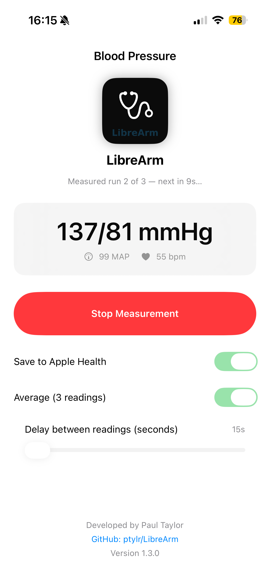

```
        __          .__
_______/  |_ ___.__.|  |_______
\____ \   __<   |  ||  |\_  __ \
|  |_> >  |  \___  ||  |_|  | \/
|   __/|__|  / ____||____/__|
|__|         \/

https://ptylr.com  
https://www.linkedin.com/in/ptylr/
```

# LibreArm

LibreArm is an open-source iOS app that connects directly to the **QardioArm** blood pressure monitor via Bluetooth Low Energy (BLE) and saves readings into **Apple Health**.  
This project exists because Qardio, Inc. shut down its backend services and app support, leaving the QardioArm hardware functional but unusable with the original app.

- 📲 **Available on the [Apple App Store](https://apps.apple.com/gb/app/librearm/id6752661389)**  
- 💻 Open source on [GitHub](https://github.com/ptylr/LibreArm) for transparency and community contributions  

---

## ✨ Features (v1.2.0)

- Connects to QardioArm over BLE (no Qardio cloud or accounts required)
- **Connection management**:
  - Start scanning automatically on launch
  - Retry button with 30-second connection timeout (hidden when connected)
  - Device status always visible in the UI
- **Measurement handling**:
  - ✅ Improved reliability: readings are now only saved to Health **once the full blood pressure cycle is complete**
  - Single, debounced save to HealthKit (no partial inflating entries)
  - Dynamic **Start/Stop button**  
    - Blue *Start Measurement* when idle  
    - Red *Stop Measurement* while inflating, sends cancel on tap
- **UI improvements**:
  - Centered title and status
  - App icon displayed in header
  - Card-style layout for latest reading (systolic, diastolic, MAP, heart rate)
  - Developer credit and GitHub link footer
- 100% local: no accounts, no data leaves your device

---

## 📲 Installation

### 1. From the App Store (recommended)
Download directly from the App Store:  
👉 [LibreArm on the App Store](https://apps.apple.com/gb/app/librearm/id6752661389)  

### 2. Build from source
If you’d like to build it yourself:

```bash
git clone https://github.com/ptylr/LibreArm.git
cd LibreArm
open LibreArm.xcodeproj
```

Requirements:
- Xcode 15+
- iOS 16+ device (QardioArm does not work in the simulator)
- Apple ID signed into Xcode (free dev account OK for local builds)

On first run you’ll be prompted for:
- **Bluetooth access** (to connect to the cuff)
- **Health access** (to save readings)

---

## 🖼 Screenshots

<table>
  <tr>
    <td></td>
    <td></td>
    <td></td>
    <td></td>
  </tr>
</table>

---

## 🔧 Development Notes

- **Language & UI**: Swift + SwiftUI
- **Bluetooth**: CoreBluetooth (service 0x1810, char 0x2A35 + vendor control UUID `583CB5B3-875D-40ED-9098-C39EB0C1983D`)
- **Health**: HealthKit (blood pressure and heart rate types)
- **App Icon**: Custom design included in `Assets.xcassets`

The app implements a debounce strategy so that **only the final reading** after a measurement is saved, preventing dozens of partial entries in Health.  
As of v1.1.1, LibreArm further ensures that **both systolic and diastolic readings are present** before saving to Apple Health.

---

## 🛡 Privacy

- LibreArm does **not** connect to the internet.  
- All readings stay on your device.  
- Data is saved into **Apple Health** if permission is granted.

---

## 🤝 Contributing

Pull requests are welcome! If you’d like to contribute improvements (UI, Bluetooth stability, documentation), please fork the repo and open a PR.

---

## 📜 License

This project is licensed under the [MIT License](LICENSE).

---

## Disclaimer
This document is provided for information purposes only. Paul Taylor may change the contents hereof without notice. This document is not warranted to be error-free, nor subject to any other warranties or conditions, whether expressed orally or implied in law, including implied warranties and conditions of merchantability or fitness for a particular purpose. Paul Taylor specifically disclaims any liability with respect to this document and no contractual obligations are formed either directly or indirectly by this document. The technologies, functionality, services, and processes described herein are subject to change without notice.

LibreArm is **not affiliated with or endorsed by Qardio, Inc.**  
QardioArm™ is a trademark of Qardio, Inc. This project is community-driven to keep existing hardware usable.
