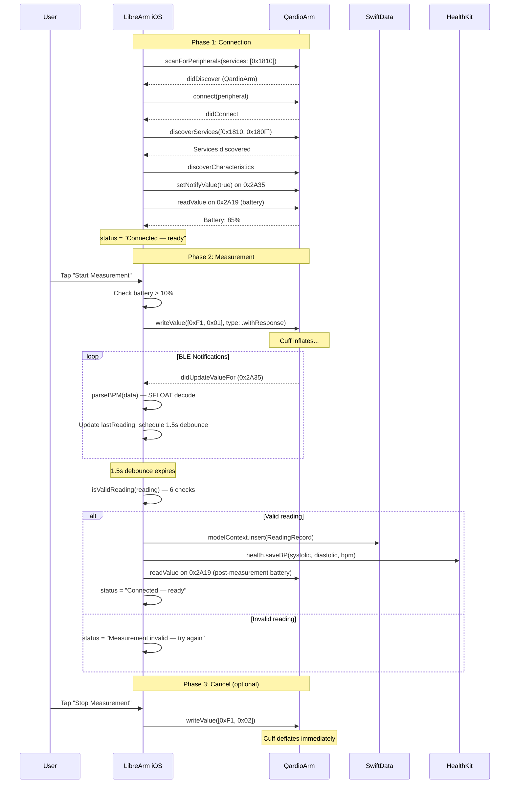

# LibreArm iOS — Design Document

| Property | Value |
|----------|-------|
| **Status** | Living Document |
| **Last Updated** | 2026-04-08 |
| **Repository** | [ptylr/LibreArm](https://github.com/ptylr/LibreArm) (MIT License) |
| **Current Version** | v1.5.0 — On the App Store |
| **License** | MIT |

> This document describes the architecture, BLE protocol, on-device storage, configuration, and proposed future features for the LibreArm iOS app. It is intended as a reference for new contributors and to provide context for design decisions.

---

## 1. Why This App Exists

### 1.1 The Qardio Bankruptcy

Qardio, Inc. filed for bankruptcy in 2024 and ceased all operations. Their official QardioApp was removed from the Apple App Store and Google Play Store. Their backend authentication servers were shut down.

Because the QardioApp required server-side authentication on every launch, **every QardioArm blood pressure monitor in the field became non-functional overnight**, despite the hardware being fully operational. The QardioArm has no standalone display — it requires a companion app to:

1. Send start/cancel commands to the cuff pump over Bluetooth
2. Receive and parse blood pressure measurement notifications
3. Display and store the readings

Thousands of users — Tim included — were left with $99-129 of medical-grade hardware they could no longer use.

### 1.2 Why This App Matters

The LibreArm iOS app was built by Paul Taylor (ptylr) to give those users their devices back. He reverse-engineered the QardioArm's BLE protocol using nRF Connect, built the app in SwiftUI, and successfully navigated Apple's medical device review to publish it on the App Store. It is:

- **Open source** under the MIT license — anyone can audit, fork, or contribute
- **Cloud-free** — no servers, no accounts, no internet required at any point
- **Privacy-preserving** — all data stays on device or in Apple HealthKit
- **Free** — no premium tier, no ads, no in-app purchases
- **App Store approved** — already published as "wellness logging" (not a regulated medical device)

Security researcher n0ps independently documented zero-day vulnerabilities in the original QardioApp (CISA Advisory ICSMA-25-044-01) including plain-text credential storage and an engineering backdoor that allowed arbitrary hex command execution. **LibreArm avoids all of these by design** — there are no credentials, no servers, and no remote access channels.

### 1.3 Our Role

Tim (a QardioArm owner) is contributing improvements to the iOS app, focused on:
1. Bug fixes (dark mode visibility on the hypertension graph)
2. Local reading history with SwiftData (the biggest gap vs. competitors)
3. Unit test coverage for the SFLOAT parser and validation logic

These contributions complement Paul's existing work and aim to extend the app's competitive position.

---

## 2. QardioArm BLE Communication Protocol

### 2.1 Service & Characteristic Map

The QardioArm advertises a standard Bluetooth SIG Blood Pressure Service combined with a vendor-specific control characteristic:

```mermaid
graph TB
    subgraph QardioArm["QardioArm BLE GATT Server"]
        subgraph BPS["Blood Pressure Service (0x1810) — Standard"]
            BPM["Measurement Char (0x2A35)<br/>Properties: Notify<br/>Format: IEEE 11073 SFLOAT<br/>Sends sys/dia/MAP/HR"]
            CTRL["Control Char (vendor-specific)<br/>UUID: 583CB5B3-875D-40ED-<br/>9098-C39EB0C1983D<br/>Properties: Write<br/>Commands: 0xF1,0x01 / 0xF1,0x02"]
        end
        subgraph BAT["Battery Service (0x180F) — Standard"]
            BATLVL["Battery Level (0x2A19)<br/>Properties: Read + Notify<br/>Format: 1 byte (0-100%)"]
        end
    end

    subgraph App["LibreArm iOS"]
        CB["CoreBluetooth<br/>CBCentralManager"]
        BPC["BPClient<br/>ObservableObject"]
        UI["ContentView<br/>SwiftUI"]
    end

    CB -->|Scan filter 0x1810| BPS
    BPC -->|writeValue [0xF1,0x01]| CTRL
    BPM -->|peripheral didUpdateValue| BPC
    BPC -->|@Published state| UI
    BATLVL -->|readValue + notify| BPC

    style BAT fill:#fff3e0,stroke:#ff9800
    style BPS fill:#e3f2fd,stroke:#2196f3
```

### 2.2 IEEE 11073 SFLOAT Data Format

Blood pressure measurements arrive on characteristic 0x2A35 in the standard Bluetooth SIG Blood Pressure Measurement format:

```
Byte Layout (minimum 7 bytes):
[0]     Flags (bit 0x02 = timestamp present, bit 0x04 = heart rate present)
[1:2]   Systolic (SFLOAT, little-endian)
[3:4]   Diastolic (SFLOAT, little-endian)
[5:6]   MAP (Mean Arterial Pressure, SFLOAT, little-endian)
[7:13]  Optional 7-byte timestamp (if flags & 0x02)
[N:N+1] Optional Heart Rate (SFLOAT, if flags & 0x04)
```

SFLOAT decoding in Swift (BPClient.swift):

```swift
func sfloat(_ lo: UInt8, _ hi: UInt8) -> Double {
    let raw = UInt16(hi) << 8 | UInt16(lo)
    let mantissa = Int16(raw & 0x0FFF)
    let exponent = Int8(Int16(raw) >> 12)  // Properly sign-extended
    let m = (mantissa >= 0x0800) ? Int32(mantissa) - 0x1000 : Int32(mantissa)
    return Double(m) * pow(10.0, Double(exponent))
}
```

> **Note**: The iOS implementation correctly sign-extends the exponent via `Int8(Int16(raw) >> 12)`. The Android version had a bug here that we caught with unit tests and fixed in PR #4 of the Android repo.

### 2.3 Measurement Sequence



### 2.4 Reading Validation (6 Rules)

| # | Rule | Range/Check | Why |
|---|------|-------------|-----|
| 1 | Diastolic > 0 | Required | Filters partial/intermediate BLE notifications |
| 2 | Values finite | Required | Filters SFLOAT NaN/Infinity |
| 3 | Systolic in 60-260 mmHg | Range | Physiological limits |
| 4 | Diastolic in 40-160 mmHg | Range | Physiological limits |
| 5 | Systolic > Diastolic | Required | Cardiovascular physiology |
| 6 | Pulse pressure ≤ 120 mmHg | Required | Filters measurement errors |

Implementation in `BPClient.isValidReading()`:

```swift
func isValidReading(_ r: BPReading) -> Bool {
    guard r.dia > 0 else { return false }
    guard r.sys.isFinite && r.dia.isFinite else { return false }
    guard r.sys >= 60 && r.sys <= 260 else { return false }
    guard r.dia >= 40 && r.dia <= 160 else { return false }
    guard r.sys > r.dia else { return false }
    guard (r.sys - r.dia) <= 120 else { return false }
    return true
}
```

### 2.5 Available Device Capabilities

| Capability | BLE Access | App Support |
|-----------|------------|------------|
| Blood pressure measurement (sys/dia) | Write start, read 0x2A35 notifications | **Yes** |
| Mean Arterial Pressure (MAP) | Bytes 5-6 of 0x2A35 | **Yes** |
| Heart rate / pulse | Optional bytes in 0x2A35 (flags & 0x04) | **Yes** |
| Start/cancel measurement | Write [0xF1,0x01] / [0xF1,0x02] to control char | **Yes** |
| Battery level monitoring | Read/notify 0x2A19 on service 0x180F | **Yes (v1.4.0)** |
| Battery state notifications | UNUserNotificationCenter triggered by state transitions | **Yes (v1.4.0)** |
| Critical battery measurement block | startMeasurement() returns early when battery ≤ 10% | **Yes (v1.4.0)** |
| Irregular heartbeat detection | Possibly bit 3 of flags byte (BT SIG spec) | Not yet implemented |
| Device timestamp | Optional 7-byte field in 0x2A35 | Parsed but not displayed |
| Firmware version | Possibly via Device Information Service (0x180A) | Not explored |

---

## 3. Application Architecture

### 3.1 Component Architecture (Post-PR State)

```mermaid
graph TB
    subgraph Entry["App Entry"]
        LAA["LibreArmApp<br/>@main<br/>Injects environment objects<br/>Configures SwiftData ModelContainer"]
    end

    subgraph Views["UI Layer (SwiftUI)"]
        CV["ContentView<br/>Main screen with reading card,<br/>graph, controls, settings"]
        HV["HistoryView<br/>List of past readings,<br/>swipe-to-delete, CSV export<br/>(NEW)"]
        HGV["HypertensionGraphView<br/>5-zone AHA chart with plot point<br/>(dark-mode-fixed)"]
    end

    subgraph Core["Core Layer"]
        BPC["BPClient<br/>NSObject + ObservableObject<br/>CoreBluetooth + protocol<br/>Battery monitoring + validation"]
        H["Health<br/>HealthKit wrapper"]
    end

    subgraph SwiftDataLayer["Persistence (SwiftData) — NEW"]
        RR["ReadingRecord @Model<br/>sys, dia, MAP, hr,<br/>timestamp, mode, savedToHealth"]
        MC["ModelContainer / ModelContext"]
    end

    subgraph Platform["Platform Services"]
        CB["CoreBluetooth"]
        HK["HealthKit Store"]
        UN["UserNotifications"]
        AS["@AppStorage / UserDefaults"]
        SD["SwiftData backing store"]
    end

    LAA -->|@StateObject| BPC
    LAA -->|@StateObject| H
    LAA -->|.modelContainer| MC
    LAA -->|hosts| CV
    CV -->|@EnvironmentObject| BPC
    CV -->|@EnvironmentObject| H
    CV -->|@Environment(modelContext)| MC
    CV -->|NavigationLink| HV
    CV --> HGV
    HV -->|@Query| RR
    BPC --> CB
    BPC --> UN
    H --> HK
    CV --> AS
    MC --> RR
    MC --> SD

    style BPC fill:#e1f5fe
    style HV fill:#fff3e0,stroke:#ff9800
    style MC fill:#fff3e0,stroke:#ff9800
    style RR fill:#fff3e0,stroke:#ff9800
```

### 3.2 Source File Inventory (Post-PR State)

```
LibreArm-iOS/
├── App/
│   ├── LibreArmApp.swift              # @main, environment objects, modelContainer
│   ├── ContentView.swift              # Main screen (reading card, graph, controls)
│   ├── HypertensionGraphView.swift    # 5-zone AHA chart (dark-mode-fixed)
│   └── HistoryView.swift              # Reading history list (NEW)
├── Core/
│   ├── BPClient.swift                 # BLE + protocol + battery + validation
│   ├── Health.swift                   # HealthKit wrapper
│   └── ReadingStore.swift             # SwiftData @Model (NEW)
├── LibreArmTests/                     # Unit tests (NEW)
│   ├── SfloatTests.swift              # 8 tests
│   └── ValidationTests.swift          # 17 tests
├── Info.plist
├── LibreArm.entitlements              # HealthKit
├── README.md
├── PRIVACY.md
├── SECURITY.md
└── CONTRIBUTING.md
```

### 3.3 Build Configuration

| Setting | Value |
|---------|-------|
| Deployment Target | iOS 16.0 |
| Swift Version | 5.9+ |
| UI Framework | SwiftUI |
| BLE Framework | CoreBluetooth |
| Health Framework | HealthKit |
| Notifications | UserNotifications |
| **Persistence** | **SwiftData (NEW — requires iOS 17+)** |
| Bundle ID | `com.ptylr.LibreArm` |
| Capabilities | HealthKit |

> **iOS version note**: SwiftData requires iOS 17+. The current LibreArm app targets iOS 16.0. PR for SwiftData history will need either:
> 1. Bumping the deployment target to iOS 17.0 (excludes ~5% of users)
> 2. Falling back to Core Data for iOS 16 users
>
> This is flagged in the PR description for Paul to decide.

---

## 4. On-Device Storage

### 4.1 Storage Locations Overview

The iOS app stores three categories of data, all on-device. Nothing is sent to any remote server.

```mermaid
graph LR
    subgraph App["LibreArm iOS App"]
        BPC["BPClient"]
        CV["ContentView"]
    end

    subgraph Storage["On-Device Storage"]
        SD[("SwiftData<br/>ReadingRecord<br/>(NEW)")]
        HK["HealthKit Store<br/>(system-managed)<br/>Correlation + Quantity samples"]
        AS["UserDefaults<br/>via @AppStorage<br/>User toggle settings"]
        MEM["In-memory state<br/>@Published properties"]
    end

    BPC -->|@Published| MEM
    CV -->|onFinalReading| SD
    CV -->|onFinalReading| HK
    CV -->|toggle changes| AS
    MEM -->|auto-redraw| CV
    SD -->|@Query| CV

    style SD fill:#fff3e0,stroke:#ff9800
    style HK fill:#e8f5e9,stroke:#4caf50
    style AS fill:#e3f2fd,stroke:#2196f3
```

### 4.2 SwiftData (New — Local History)

**File**: SwiftData uses a SQLite-backed store managed by the framework. Located in the app's sandbox at `~/Library/Application Support/default.store`.

**Model**:

```swift
@Model
class ReadingRecord {
    var systolic: Double
    var diastolic: Double
    var meanArterialPressure: Double?
    var heartRate: Double?
    var timestamp: Date
    var mode: String          // "single" or "average3"
    var savedToHealth: Bool

    init(systolic: Double, diastolic: Double, map: Double? = nil,
         hr: Double? = nil, timestamp: Date = .now,
         mode: String = "single", savedToHealth: Bool = false) {
        self.systolic = systolic
        self.diastolic = diastolic
        self.meanArterialPressure = map
        self.heartRate = hr
        self.timestamp = timestamp
        self.mode = mode
        self.savedToHealth = savedToHealth
    }
}
```

**Container setup** in `LibreArmApp.swift`:

```swift
@main
struct LibreArmApp: App {
    @StateObject private var health = Health()
    @StateObject private var bp = BPClient()

    var body: some Scene {
        WindowGroup {
            ContentView()
                .environmentObject(health)
                .environmentObject(bp)
        }
        .modelContainer(for: ReadingRecord.self)
    }
}
```

**Query in HistoryView**:

```swift
@Query(sort: \ReadingRecord.timestamp, order: .reverse)
private var readings: [ReadingRecord]
```

### 4.3 HealthKit (System Hub)

**What gets written**:

```swift
func saveBP(systolic: Double, diastolic: Double, bpm: Double?, date: Date) async throws {
    let mmHg = HKUnit.millimeterOfMercury()
    let sType = HKQuantityType.quantityType(forIdentifier: .bloodPressureSystolic)!
    let dType = HKQuantityType.quantityType(forIdentifier: .bloodPressureDiastolic)!

    let sSample = HKQuantitySample(type: sType,
                                   quantity: .init(unit: mmHg, doubleValue: systolic),
                                   start: date, end: date)
    let dSample = HKQuantitySample(type: dType,
                                   quantity: .init(unit: mmHg, doubleValue: diastolic),
                                   start: date, end: date)

    let corrType = HKCorrelationType.correlationType(forIdentifier: .bloodPressure)!
    try await store.save(HKCorrelation(type: corrType, start: date, end: date,
                                       objects: [sSample, dSample]))

    if let bpm = bpm {
        let unit = HKUnit.count().unitDivided(by: .minute())
        let hrType = HKQuantityType.quantityType(forIdentifier: .heartRate)!
        let hrSample = HKQuantitySample(type: hrType,
                                        quantity: .init(unit: unit, doubleValue: bpm),
                                        start: date, end: date)
        try await store.save(hrSample)
    }
}
```

**Permissions requested at launch**:
- `bloodPressureSystolic` (write)
- `bloodPressureDiastolic` (write)
- `heartRate` (write)

**Why HealthKit**: It serves as the integration hub for iOS. Any app that reads blood pressure from HealthKit (MyFitnessPal, Cardiogram, third-party trackers) automatically gets LibreArm's data without LibreArm needing custom integrations.

### 4.4 UserDefaults (User Settings via @AppStorage)

| Key | Type | Default | Purpose |
|-----|------|---------|---------|
| `autoSaveToHealth` | Bool | `true` | Auto-save readings to Apple HealthKit |
| `measurementMode` | String | `"single"` | "single" or "average3" |
| `delayBetweenRuns` | Double | `30.0` | Seconds between average-of-3 readings |

Used via SwiftUI's `@AppStorage` property wrapper:

```swift
@AppStorage("autoSaveToHealth") private var autoSaveToHealth = true
@AppStorage("measurementMode") private var measurementModeString = "single"
@AppStorage("delayBetweenRuns") private var delayBetweenRuns: Double = 30.0
```

### 4.5 In-Memory State (Runtime Only)

`BPClient` exposes `@Published` properties that drive the SwiftUI views:

```swift
@Published var status = "Searching for device…"
@Published var lastReading: BPReading?
@Published var isConnected = false
@Published var canMeasure = false
@Published var isMeasuring = false
@Published var measurementMode: MeasurementMode = .single
@Published var delayBetweenRuns: Double = 15
@Published var batteryLevelPct: Int? = nil
@Published var batteryStatusLine: String = "Battery: unavailable"
```

Lost on app termination. Reconnects fresh on next launch.

---

## 5. Configuration

### 5.1 User-Facing Configuration

All user settings are simple toggles or sliders in the main UI.

| Setting | UI Control | Storage | Values |
|---------|-----------|---------|--------|
| Save to Apple Health | Toggle | @AppStorage | true/false |
| Average mode (3 readings) | Toggle | @AppStorage | "single" / "average3" |
| Delay between average readings | Slider | @AppStorage | 15s / 30s / 45s / 60s |
| HealthKit permissions | System dialog | HealthKit | granted/denied |
| Bluetooth permissions | iOS automatic | Info.plist | requires NSBluetoothAlwaysUsageDescription |
| Notification permissions | System dialog | iOS | granted/denied |

### 5.2 Compile-Time Constants

Hard-coded constants in `BPClient.swift`:

```swift
private let bpsService = CBUUID(string: "1810")
private let measurement = CBUUID(string: "2A35")
private let control = CBUUID(string: "583CB5B3-875D-40ED-9098-C39EB0C1983D")
private let batteryService = CBUUID(string: "180F")
private let batteryLevel = CBUUID(string: "2A19")

private let startCommand  = Data([0xF1, 0x01])
private let cancelCommand = Data([0xF1, 0x02])

private let completionDebounceSeconds: TimeInterval = 1.5
```

### 5.3 Entitlements & Info.plist

**LibreArm.entitlements**:
- `com.apple.developer.healthkit` = `true`

**Info.plist requirements** (Apple-required usage strings):
- `NSBluetoothAlwaysUsageDescription` — Why the app needs Bluetooth
- `NSHealthShareUsageDescription` — Why the app needs to read Health data (currently not requesting reads, but Apple still requires the string)
- `NSHealthUpdateUsageDescription` — Why the app needs to write Health data

---

## 6. Currently Implemented Features

### 6.1 Already in Upstream v1.5.0

| Feature | Implementation |
|---------|---------------|
| BLE scan + connect to QardioArm | `BPClient.startConnect()` with 30s timeout |
| Single measurement mode | `BPClient.startMeasurement()` writes [0xF1,0x01] |
| Average-of-3 measurement mode | `remainingRuns` counter + countdown delay |
| Configurable delay (15/30/45/60s) | Slider with snap-to-grid |
| BLE measurement parsing (SFLOAT) | `parseBPM` with sign-extended exponent |
| Strict reading validation | All 6 rules in `isValidReading()` |
| 1.5s debounce after last notification | Timer-based |
| Display last reading (sys/dia/MAP/HR) | SwiftUI Card with icons |
| **Hypertension graph (5 zones)** | `HypertensionGraphView` Canvas drawing |
| **Battery monitoring (v1.4.0)** | Battery service discovery + UI display |
| **Battery notifications (background)** | UNUserNotificationCenter |
| **Critical battery measurement block** | `startMeasurement()` early return when ≤10% |
| HealthKit integration | `Health` wrapper with correlation + HR sample |
| Settings persistence | `@AppStorage` |
| Keep screen on during measurement | `UIApplication.isIdleTimerDisabled` |
| Permission flow (Bluetooth + HealthKit) | Automatic on launch |
| App Store published | v1.5.0 currently live |

### 6.2 Implemented in Open PRs (Awaiting Review)

| # | PR | Feature | Status |
|---|-----|---------|--------|
| #21 | [Dark mode fix](https://github.com/ptylr/LibreArm/pull/21) | HypertensionGraphView uses Color.primary instead of hardcoded black | Open |
| (TBD) | Local history with SwiftData | ReadingRecord model + HistoryView + CSV export | Branch ready |
| (TBD) | Unit tests | XCTest suite for SFLOAT decoder + validation | Branch ready |

> Note: PRs for local history and unit tests are pushed to our fork but not yet submitted to upstream. We're waiting for ptylr to respond to the initial outreach (#20) and the dark mode PR (#21) before submitting more.

### 6.3 Implementation Details: New Features

#### 6.3.1 Dark Mode Fix (PR #21)

The hypertension graph used hardcoded `Color.black` for zone borders, text labels, and the plot point — making them invisible in dark mode.

**Fix**: 14 color replacements across `HypertensionGraphView.swift`:
- Zone border strokes (4 instances): `Color.black` → `Color.primary`
- Zone text labels (5 instances): `.foregroundStyle(.black)` → `.foregroundStyle(.primary)`
- Plot point fill: `.fill(.black)` → `.fill(Color.primary)`
- Plot point border: `.strokeBorder(.white)` → `.strokeBorder(Color(UIColor.systemBackground))`
- Plot point shadow: `.black.opacity(0.5)` → `Color.primary.opacity(0.5)`

`Color.primary` automatically adapts: black in light mode, white in dark mode. Zero behavior change in light mode.

#### 6.3.2 Local History with SwiftData

**HistoryView layout**:

```
┌─────────────────────────────┐
│  History            ⤴      │ ← Toolbar with ShareLink
├─────────────────────────────┤
│  ▼ April 8, 2026            │
│  ●  138/88 mmHg     14:23  │
│  ●  124/79 mmHg     09:15  │
│                             │
│  ▼ April 7, 2026            │
│  ●  118/76 mmHg (avg) 18:42│
└─────────────────────────────┘
```

Features:
- `@Query` with reverse-chronological sort
- Section headers grouped by date (`Calendar.startOfDay`)
- Color category dot per reading (matches hypertension graph zones)
- Swipe-to-delete via `.onDelete { context.delete(...) }`
- ShareLink in toolbar exports CSV
- ContentUnavailableView when empty

CSV export format:
```
Date,Time,Systolic,Diastolic,MAP,HeartRate,Mode
2026-04-08,14:23:15,138,88,105,72,single
2026-04-08,09:15:42,124,79,94,68,single
```

#### 6.3.3 Unit Tests

**SfloatTests.swift** (8 tests):
- Zero, normal values (120, 80, 72), positive exponent (150), value 200, negative exponent (0.1), negative mantissa (-1)

**ValidationTests.swift** (17 tests):
- Valid: normal reading, with HR, min/max boundaries, pulse pressure at limit
- Invalid: dia=0, NaN sys, NaN dia, infinite sys, sys<60, sys>260, dia<40, dia>160, sys<=dia, sys==dia, pulse pressure 200, pulse pressure 121

Tests use mirrored logic from `BPClient` for direct unit testing without requiring CoreBluetooth or a BLE device.

---

## 7. Proposed Future Features (Not Yet Implemented)

### 7.1 Trend Charts with Swift Charts

**Need**: Users want to see BP trends over weeks and months. Swift Charts (iOS 16+) makes this straightforward.

**Proposed design**:
- New `TrendsView.swift` with `Chart` containing `LineMark` for systolic/diastolic
- Date-range picker (7 day, 30 day, 90 day, custom)
- Min/max/average summary statistics
- Toggle between chart types (line, bar, scatter)
- Data sourced from SwiftData `@Query` with date range predicate

### 7.2 Measurement Reminders

**Need**: Consistent BP monitoring requires regular measurements. AHA recommends multiple readings per day at consistent times.

**Proposed design**:
- `UserNotifications` daily local notifications at user-configured time(s)
- Settings UI: toggle + time picker
- Notification taps deep-link to ContentView
- Persisted in @AppStorage

### 7.3 Notes per Reading

**Need**: Context matters. Was the reading taken after exercise? In the morning?

**Proposed design**:
- Add `notes: String?` property to `ReadingRecord` (SwiftData migration v2)
- Optional sheet after reading completion: "Add a note?"
- HistoryView displays notes inline below the reading
- CSV export includes notes column

### 7.4 PDF Doctor Reports

**Need**: Doctors prefer formatted PDF reports over CSV.

**Proposed design**:
- Use `ImageRenderer` to render a SwiftUI report view to PDF
- Report includes: date range, summary statistics, reading list, classification breakdown
- Share via `ShareLink` with PDF MIME type

### 7.5 Multi-User Profiles

**Need**: Families share QardioArm devices.

**Proposed design**:
- Add `profileName: String` to `ReadingRecord` (SwiftData migration v3)
- Profile picker in toolbar
- Independent history filtered by profile
- Settings stored per profile via custom UserDefaults suite

### 7.6 Irregular Heartbeat Detection

**Need**: The original QardioApp detected irregular heartbeats. Bluetooth SIG specifies bit 3 of the flags byte for "Irregular Pulse Detection".

**Proposed design**:
- In `parseBPM`, check `(flags & 0x08) != 0`
- Add `irregularHeartbeat: Bool` to `BPReading` and `ReadingRecord`
- Display warning icon next to the heart rate when set
- Include in CSV export

### 7.7 Apple Watch Complication

**Need**: Quick measurement initiation from Apple Watch. Limited platform APIs prevent the watch from doing the actual BP measurement, but it can trigger the phone.

**Proposed design**:
- Watch app exposes a "Take Measurement" complication
- Communicates with the phone via `WatchConnectivity`
- Phone app receives message, wakes, starts measurement
- Watch displays the result via `transferUserInfo`

### 7.8 Siri Shortcuts / App Intents

**Need**: "Hey Siri, take my blood pressure"

**Proposed design**:
- Define an `AppIntent` for "Take Blood Pressure Reading"
- Returns a structured result Siri can speak aloud
- Donate the intent after each measurement so the system surfaces it
- Integrates with Shortcuts for automation (e.g., "Every morning at 8am, take blood pressure")

### 7.9 LLM-Ready Data Export

**Need**: MedM pioneered exporting BP data in a format ready for LLMs.

**Proposed design**:
- "Share with AI" button in HistoryView
- Generates Markdown summary with structured data + classification + trends
- Copies to clipboard or shares via ShareLink
- No external API calls

### 7.10 FHIR R4 Export

**Need**: First-mover opportunity. No consumer BP app currently exports FHIR.

**Proposed design**:
- Generate `Observation` resources following FHIR Vital Signs profile
- LOINC codes: 8480-6 (systolic), 8462-4 (diastolic), 8867-4 (heart rate)
- Bundle as `Bundle` resource
- Export as JSON file via ShareLink

---

## 8. Risks and Mitigations

| Risk | Impact | Mitigation |
|------|--------|------------|
| ptylr unresponsive to PRs | Medium | Plan B is to fork (deadline 2026-05-05). README explicitly says "PRs welcome" so contribution is encouraged. |
| SwiftData iOS 17+ requirement | Medium | Discuss with ptylr; offer Core Data fallback if iOS 16 support is required |
| App Store rejection on update | Low | Already approved as "wellness logging"; maintaining the same positioning |
| HealthKit policy changes | Low | HealthKit has been stable for 10+ years |
| QardioArm 2 has different protocol | Low | Out of scope for v1; would be a separate effort |

---

## 9. References

### Project links
- [ptylr/LibreArm (upstream)](https://github.com/ptylr/LibreArm)
- [Spockinnator/LibreArm (our fork)](https://github.com/Spockinnator/LibreArm)
- [LibreArm on the App Store](https://apps.apple.com/ca/app/librearm/id6752661389)
- [LibreArm Blog Post by Paul Taylor](https://ptylr.com/posts/2025-09-28-librearm-breathing-new-life-into-qardioarm-devices)

### Open issues & PRs
- [Outreach issue #20](https://github.com/ptylr/LibreArm/issues/20)
- [PR #21 — Dark mode fix](https://github.com/ptylr/LibreArm/pull/21)

### Technical
- [Bluetooth SIG Blood Pressure Profile 1.1.1](https://www.bluetooth.com/specifications/specs/blood-pressure-profile-1-1-1/)
- [IEEE 11073-10407 BP Monitor Standard](https://standards.ieee.org/standard/11073-10407-2020.html)
- [CISA Advisory ICSMA-25-044-01](https://www.cisa.gov/news-events/ics-medical-advisories/icsma-25-044-01)
- [Reversing the QardioArm — n0ps](https://n0psn0ps.github.io/2025/02/13/Reversing-the-QardioArm/)
- [Apple HealthKit Documentation](https://developer.apple.com/documentation/healthkit)
- [SwiftData Documentation](https://developer.apple.com/documentation/swiftdata)
